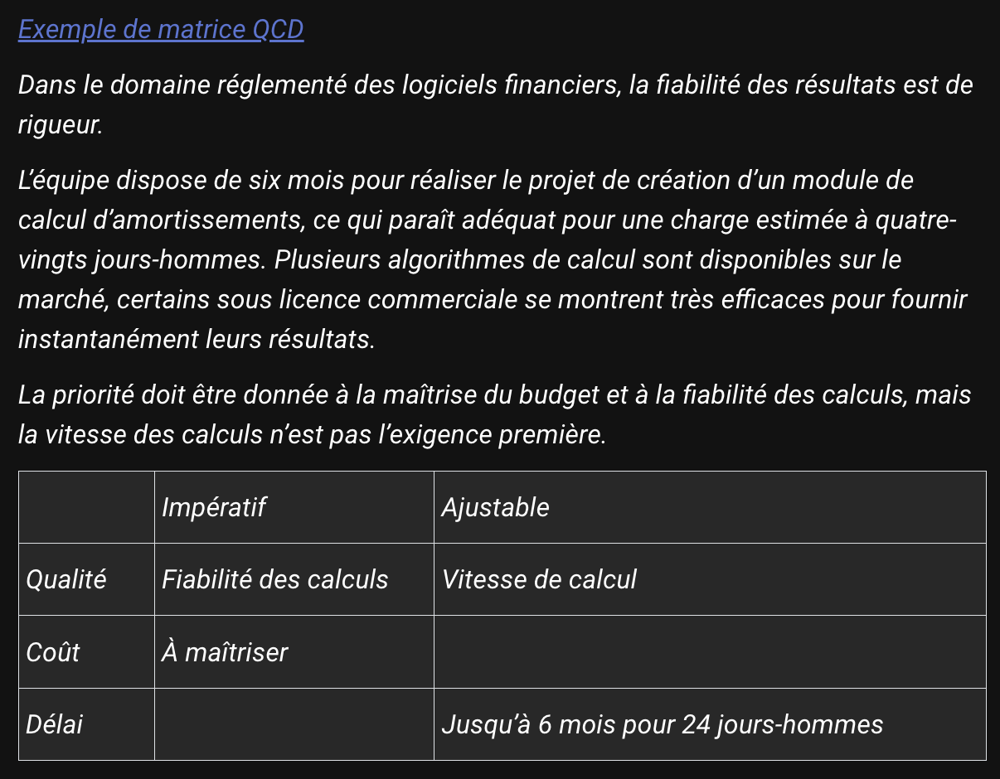

# La Gestion de Projet Informatique : Un Art d'Orchestration

## 🎯 Différentes Perspectives

-   **Commanditaire** : Focus sur les bénéfices et résultats
-   **Chef de Projet** : Conscience des contraintes et défis
-   **Point commun** : Création de valeur

## 🔑 Facteurs de Réussite

-   Combinaison de :
    -   Organisation
    -   Savoir-faire
    -   Adaptabilité
    -   Une part de chance

## 🎭 Le Chef de Projet : Un Chef d'Orchestre

1. **Chef d'orchestre** du rythme
2. **Gardien** de la communication
3. **Manager** d'équipe
4. **Pilote** stratégique

## 📊 Rôles Essentiels du Chef de Projet

-   Impulser le rythme
-   Maintenir la communication
-   Gérer les parties prenantes
-   Prévenir les malentendus
-   Maximiser la motivation

## 🎯 La Clé du Succès

-   Point de départ : Identification des enjeux
-   Point d'arrivée : Atteinte des objectifs
-   Entre les deux : Un itinéraire unique à tracer

## 💡 Points de Vigilance

-   Définition claire des besoins
-   Communication constante
-   Cohésion d'équipe
-   Suivi des objectifs

# L'Identification des Enjeux : La Fondation du Projet

## 🎯 Questions Fondamentales

-   Quelles sont les motivations ?
-   Qu'est-ce qui est primordial vs secondaire ?
-   Quels sont les critères de réussite ?

## 📊 Importance des Enjeux

### Pour les grands projets

-   Nécessaires pour l'engagement des ressources
-   Évitent les risques d'échec

### Pour les petits projets

-   Équilibrent réalisation et organisation
-   Assurent un pilotage efficace

## 🔑 Cadre Stratégique Typique

-   Renforcement commercial
-   Conquête de marchés
-   Transformation organisationnelle
-   Rationalisation
-   Partenariats stratégiques
-   Fidélisation client

## 📋 Bonnes Pratiques

-   2 à 4 enjeux majeurs (recommandé)
-   Focus sur le "quoi" et non le "comment"
-   Alignement avec la stratégie d'entreprise

## 💡 Caractéristiques des Enjeux

Peuvent inclure :

-   Objectifs stratégiques
-   Éléments chiffrés
-   Références aux dispositifs existants

## 🎯 Exemple Concret

1. Fiabiliser la mesure de satisfaction
2. Maximiser l'indice de satisfaction
3. Communiquer sur les évolutions et actions

# Définir les Objectifs : Le Cap à Suivre

## 🎯 Principe Fondamental

-   Reformulation des enjeux en réalisations concrètes
-   Réponse à la question : "Que veut-on obtenir ?"
-   Focus sur le résultat, pas sur le "comment"

## ⚡ Points Clés

1. Projection vers un résultat attendu
2. Applicable même en méthodes agiles
3. Abstraction des contraintes techniques
4. Maximum 10 points indépendants

## ⚠️ Pièges à Éviter

-   Auto-limitation des équipes
-   Conditionnement par les contraintes techniques
-   Limitation due à la peur du chiffrage
-   Dépendances entre objectifs

## 💫 Approche Recommandée

-   Rester simple mais ambitieux
-   S'affranchir des contraintes initiales
-   Garder les arbitrages pour plus tard
-   Maintenir l'indépendance des objectifs

## 📋 Exemple Concret

1. Publier les rapports de satisfaction
2. Mesurer la satisfaction post-transaction
3. Comparer les indicateurs annuels

## 🔄 Méthodes Agiles

-   Compatible avec l'évolution du besoin
-   Projection par sprint
-   Flexibilité dans l'exécution

# Définir le Périmètre du Projet

## 🎯 Définition du Périmètre

-   Définit la portée du projet
-   Établit les limites théoriques
-   Précise ce qui est inclus ET exclu

## 📋 Deux Approches

### 1. Approche Descriptive

-   Liste détaillée des objectifs inclus
-   Énumération des éléments hors périmètre
-   Méthode empirique mais efficace

### 2. Approche Estimative

-   Calibrage du projet
-   Estimation des coûts approximatifs
-   Calcul des jours de réalisation

## ⚖️ La Matrice QCD (Qualité, Coût, Délai)

### Dimensions clés :

1. **Qualité**
    - Niveau de performance
    - Standards à atteindre
2. **Coût**
    - Budget global
    - Ressources nécessaires
3. **Délai**
    - Temps de réalisation
    - Planning prévisionnel

## 🎲 Points d'Équilibre

-   Impossible d'optimiser tous les axes
-   Nécessité de compromis (trade-offs)
-   Adaptation selon les priorités du projet

## 💡 Exemple Concret : Module Financier

### Priorités définies

-   ✅ Fiabilité des calculs (Qualité)
-   ✅ Maîtrise du budget (Coût)
-   ➖ Vitesse de calcul (ajustable)
-   ➖ Délai jusqu'à 6 mois (flexible)

## 🔑 Conseils Pratiques

-   Définir les axes prioritaires
-   Impliquer les parties prenantes
-   Identifier les éléments non négociables
-   Prévoir les marges d'ajustement
