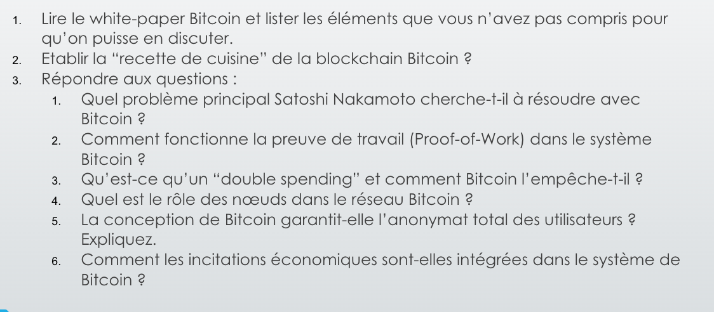

# White paper bitcoin

La recette de cuisine de la blockchain bitcoin

- Proof of work
- Chaine de blocs
- décentralisation des noeuds
- chiffrement asymétrique

Problème principale a résoudre avec bitcoin 

Le problème fondamental que Bitcoin cherche à résoudre est celui des paiements électroniques sans intermédiaire de confiance. Dans le système financier traditionnel, toutes les transactions électroniques nécessitent une institution financière comme intermédiaire, ce qui entraîne:

- Des frais de médiation élevés limitant les micro-transactions
- L'impossibilité de réaliser des transactions véritablement irréversibles
- Un besoin de confiance accru entre commerçants et clients
- Des risques de fraude acceptés comme inévitables

Bitcoin propose un système de paiement électronique basé sur des preuves cryptographiques plutôt que sur la confiance, permettant à deux parties de transiger directement sans besoin d'un tiers de confiance.

Comment fonctionne POW avec bitcoin :

Le Proof-of-Work est le mécanisme fondamental qui sécurise la blockchain Bitcoin:

1. Pour créer un bloc, un nœud doit trouver une valeur (nonce) qui, ajoutée aux données du bloc et passée dans une fonction de hachage (SHA-256), produit un hash commençant par un certain nombre de zéros.
2. Cette recherche nécessite une puissance de calcul considérable car il n'existe pas de méthode plus efficace que l'essai de valeurs aléatoires.
3. La difficulté (nombre de zéros requis) s'ajuste automatiquement pour maintenir une moyenne d'un bloc toutes les 10 minutes environ.
4. Une fois trouvé, le POW peut être vérifié instantanément par les autres nœuds.

Ce système présente plusieurs avantages:

- L'effort pour modifier un bloc augmente exponentiellement avec le nombre de blocs qui le suivent
- Il établit une représentation objective de la "majorité" basée sur la puissance de calcul, pas sur le nombre d'adresses IP
- Il incite les nœuds à rester honnêtes (il est plus profitable de suivre les règles)

C’est quoi le `double spending` et comment Bitcoin l’empêche t il :

Le "double-spending" (double dépense) est un problème fondamental des monnaies numériques: la possibilité de dépenser la même unité monétaire plusieurs fois.

Dans les systèmes traditionnels, ce problème est résolu par une autorité centrale (comme une banque) qui vérifie chaque transaction. Bitcoin résout ce problème sans autorité centrale via:

1. Un réseau pair-à-pair où toutes les transactions sont publiquement annoncées
2. Un système d'horodatage distribué (timestamp server)
3. La création d'une chaîne de blocs publique et immuable
4. Un mécanisme de consensus basé sur le principe "une-CPU-un-vote"

La règle fondamentale est que seule la première dépense d'une pièce est considérée valide. La blockchain devient alors un registre public inaltérable qui empêche le double-spending

Quel est le role des noeuds dans le reseau Bitcoin

Les nœuds du réseau Bitcoin ont plusieurs fonctions essentielles:

1. **Diffusion des transactions**: Ils reçoivent et transmettent les nouvelles transactions à tous les autres nœuds.
2. **Validation des transactions**: Ils vérifient que chaque transaction respecte les règles du protocole.
3. **Création de blocs**: Ils regroupent les transactions en blocs et travaillent à résoudre le proof-of-work.
4. **Propagation des blocs**: Quand un nœud résout le POW, il diffuse le bloc à tout le réseau.
5. **Vérification des blocs**: Les nœuds n'acceptent un bloc que si toutes ses transactions sont valides.
6. **Sélection de la chaîne**: Ils travaillent toujours sur la chaîne la plus longue, considérée comme la version correcte de l'historique.

Les nœuds peuvent rejoindre ou quitter le réseau à volonté, acceptant la chaîne POW la plus longue comme preuve de ce qui s'est passé pendant leur absence. Ils "votent" avec leur puissance de calcul en choisissant de prolonger certains blocs et d'en rejeter d'autres.

La conception de Bitcoin

La conception de Bitcoin repose sur plusieurs principes novateurs:

1. **Architecture décentralisée**: Un réseau pair-à-pair sans point de défaillance unique.
2. **Chaîne de signatures numériques**: Chaque "pièce" est une chaîne de signatures permettant le transfert de propriété.
3. **Blockchain**: Une structure de données qui enregistre chronologiquement toutes les transactions.
4. **Mécanisme d'incitation**: Les mineurs sont récompensés par de nouvelles pièces et des frais de transaction.
5. **Limite d'émission fixe**: Un maximum de 21 millions de bitcoins pourront être créés.
6. **Protection de la vie privée**: Les clés publiques restent anonymes bien que toutes les transactions soient publiques.
7. **Simplicité structurelle**: Le réseau fonctionne avec peu de coordination entre les nœuds.
8. **Robustesse mathématique**: La sécurité repose sur des principes cryptographiques et probabilistes.