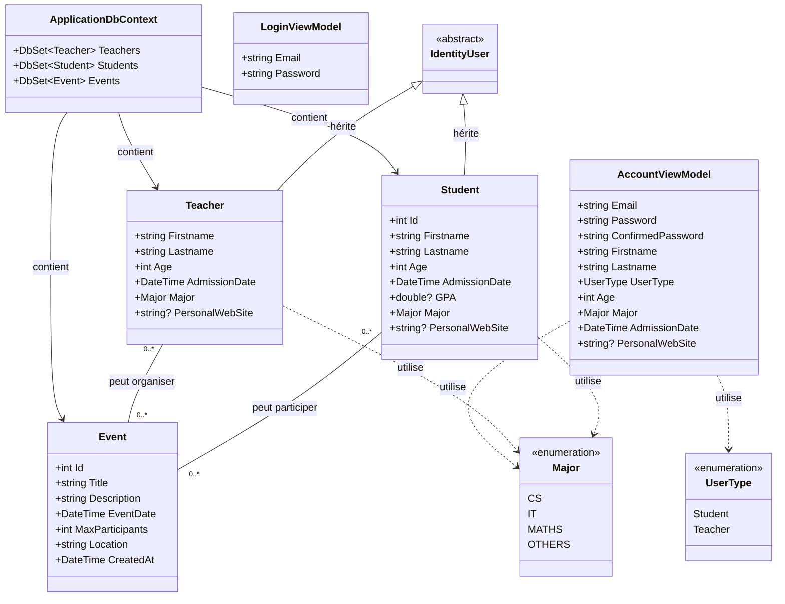

# Projet etudiants / professeurs
## Installer 

Installer dotnet 8.
`https://dotnet.microsoft.com/fr-fr/download/dotnet/8.0`

Installer les packages, en ce mettant à la racine du projet.
```bash
dotnet build
```

# Lancer le projet 
Dans `/mvcTemplate`, lancer la commande en ayant docker d'installé et lancé :
```bash
docker-compose up -d
```

Faire les migrations avec dotnet ef
```bash
dotnet ef database update
```

Lancer le projet avec 
```bash
dotnet run
```
Enfin, ont peut y acceder depuis l'adresse `http://localhost:5077`.

## Interface
Il faut s'inscrire en tant que Teacher pour avoir tous les droits et ajoutes plusieurs utilisateurs afin de manipuler l'interface.

Les professeurs peuvent :
- Voir, ajouter, modifier, supprimer un évennement
- Voir, ajouter, modifier, supprimer un étudiant
- Voir, ajouter, modifier, supprimer un professeur

Les étudiant peuvent :
- Voir un évennement
- Voir, ajouter un étudiant
- Voir, ajouter un professeur

## Diagramme de classes

