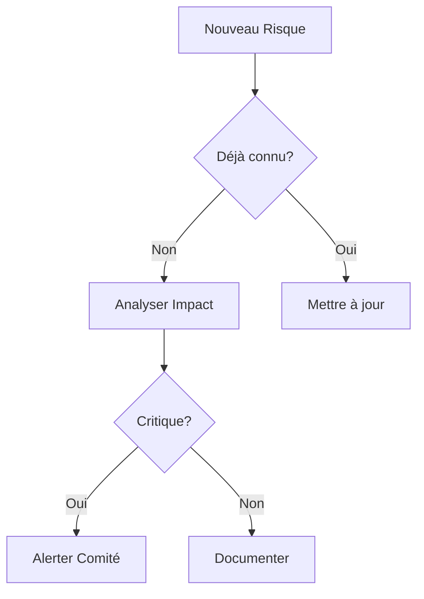

# Les Trois Axes de la Gestion de Projet

---

## Introduction

-   La complexité de la gestion de projet : par où commencer ?
-   Un cadre structuré pour s'organiser
-   Une approche tridimensionnelle

---

## Les Trois Dimensions Clés

1. Axe du Temps (cycle de vie)
2. Axe d'Analyse (niveau d'abstraction)
3. Axe de Pilotage (cycle de décision)

---

## Axe du Temps (Développement)

-   Expression des besoins
-   Phases de développement
-   Livraison
-   Maintenance
-   ⚠️ Sans cet axe :
    -   Non-conformité aux besoins
    -   Dérive du projet
    -   Tests insuffisants

---

## Axe d'Analyse (Abstraction)

-   Du conceptuel au concret
-   Niveau d'abstraction variable selon les phases
-   Compatible avec UML et Merise
-   ⚠️ Sans cet axe :
    -   Code non optimal
    -   Fonctions majeures oubliées
    -   Difficultés d'évolution

---

## Axe de Pilotage (Décision)

-   Points de contrôle
-   Gestion des aléas
-   Prises de décision
-   ⚠️ Sans cet axe :
    -   Objectifs non tenus
    -   Équipe désorganisée
    -   Rejet de l'application

---

## L'Importance de l'Intégration

-   Les méthodes doivent fonctionner ensemble
-   Éviter l'application isolée des méthodes
-   Rechercher l'harmonie entre les trois axes
-   Communication efficace nécessaire

---

## Risques à Éviter

-   Application cloisonnée des méthodes
-   Vision trop conceptuelle
-   Inadéquation du pilotage
-   Manque de tests d'intégration
-   Absence de conduite du changement

---

## Conclusion

-   Les trois axes sont interdépendants
-   Le succès repose sur leur intégration harmonieuse
-   Importance d'une approche pratique et équilibrée

# Les Trois Axes de la Gestion de Projet

---

## Introduction

-   La complexité de la gestion de projet : par où commencer ?
-   Un cadre structuré pour s'organiser
-   Une approche tridimensionnelle

---

## Les Trois Dimensions Clés

1. Axe du Temps (cycle de vie)
2. Axe d'Analyse (niveau d'abstraction)
3. Axe de Pilotage (cycle de décision)

---

## Axe du Temps (Développement)

-   Expression des besoins
-   Phases de développement
-   Livraison
-   Maintenance
-   ⚠️ Sans cet axe :
    -   Non-conformité aux besoins
    -   Dérive du projet
    -   Tests insuffisants

---

## Axe d'Analyse (Abstraction)

-   Du conceptuel au concret
-   Niveau d'abstraction variable selon les phases
-   Compatible avec UML et Merise
-   ⚠️ Sans cet axe :
    -   Code non optimal
    -   Fonctions majeures oubliées
    -   Difficultés d'évolution

---

## Axe de Pilotage (Décision)

-   Points de contrôle
-   Gestion des aléas
-   Prises de décision
-   ⚠️ Sans cet axe :
    -   Objectifs non tenus
    -   Équipe désorganisée
    -   Rejet de l'application

---

## L'Importance de l'Intégration

-   Les méthodes doivent fonctionner ensemble
-   Éviter l'application isolée des méthodes
-   Rechercher l'harmonie entre les trois axes
-   Communication efficace nécessaire

---

## Risques à Éviter

-   Application cloisonnée des méthodes
-   Vision trop conceptuelle
-   Inadéquation du pilotage
-   Manque de tests d'intégration
-   Absence de conduite du changement

---

## Conclusion

-   Les trois axes sont interdépendants
-   Le succès repose sur leur intégration harmonieuse
-   Importance d'une approche pratique et équilibrée

# Les Modèles de Développement

## Un choix stratégique pour le chef de projet

---

## Introduction

-   Premier choix crucial du chef de projet
-   Impact sur l'organisation temporelle
-   Pas de modèle universel : tout dépend du contexte
-   Six principaux modèles à considérer

---

## 1. Le Modèle Cascade

### Structure

-   Progression linéaire
-   Chaque étape suit la précédente
-   Pas de retour en arrière facile

### Étapes clés

1. Idée - démarrage
2. Expression des besoins
3. Spécifications
4. Développement
5. Tests unitaires
6. Tests d'intégration
7. Tests fonctionnels
8. Installation

### Point d'attention

-   Coût exponentiel des modifications tardives
-   "Effet cascade" : difficile de remonter le courant

---

## 2. Le Modèle en V

### Caractéristiques

-   Évolution du modèle cascade
-   Anticipation des tests
-   Symétrie entre conception et validation

### Avantages

-   Tests sous-traités et objectifs
-   Vérification précoce de la couverture fonctionnelle
-   Limitation des erreurs de conception

### Inconvénient

-   Durée augmentée de 30-40%

---

## 3. Le Modèle Itératif

### Principes

-   Succession de mini-cascades
-   Focus sur les risques techniques
-   Évolution constante des périmètres

### Organisation

-   Début par les parties complexes
-   Phases de stabilisation
-   Phases d'industrialisation

---

## 4. Le Modèle RAD (Rapid Application Development)

### Caractéristiques

-   Exploration fonctionnelle
-   Maquettage graphique important
-   Forte implication client

### Conditions de réussite

-   Technologies robustes et matures
-   Outils de développement de haut niveau
-   Plateforme standard

### Usage

-   Privilégié par les SSII
-   Adapté aux prototypes (POC)

---

## 5. Le Modèle Extreme Programming

### Spécificités

-   Cycles courts
-   Binôme junior/senior
-   Tests précoces
-   Intégration continue

### Points forts

-   Livraisons fréquentes
-   Transmission de compétences
-   Feedback client régulier
-   Tests automatisés

---

## 6. Le Modèle RUP (Rational Unified Process)

### Caractéristiques

-   Basé sur UML
-   Intègre la gestion de projet
-   Niveau conceptuel élevé

### Variantes

-   RUP (IBM Rational)
-   XUP (Extreme Programming + UP)
-   2TUP (Two Tracks UP)

---

## Conclusion

-   Choix selon les caractéristiques du projet
-   Impact sur l'organisation et le résultat
-   Importance de l'adéquation avec :
    -   L'équipe
    -   Les technologies
    -   Les contraintes du projet
    -   Les attentes client

# Le Modèle d'Analyse

## Principes et Méthodes de Modélisation

---

## Introduction

-   Étude du système en devenir
-   Importance de définir les contours du système
-   Focus sur les stimuli utilisateurs
-   Défi : modéliser ce qui n'existe pas encore

---

## 1. Le Principe de Modélisation

### Définition

-   Abstraction de la réalité
-   Description formalisée du système cible
-   Outil de définition des priorités

### Les 3 Étapes Clés

1. **Abstraction**

    - Analyse de l'existant
    - Extraction de l'essentiel
    - Évitement des biais

2. **Instanciation**

    - Création d'instances concrètes
    - Transformation en code
    - Application du modèle

3. **Vérification**
    - Confrontation avec la réalité
    - Validation des règles sémantiques
    - Ajustements nécessaires

---

## 2. Exemple Pratique : Le Dictionnaire de Termes

### Processus

1. **Inventaire**

    - Liste brute par métier
    - Sans classification préalable
    - Exhaustivité non requise

2. **Modélisation**

    - Identification des relations
    - Regroupements logiques
    - Établissement des hiérarchies

3. **Vérification**
    - Test des relations établies
    - Identification des incohérences
    - Ajustements du modèle

---

## 3. Le Modèle Merise

### Caractéristiques

-   Formalisme orienté bases de données
-   Approche descendante
-   Forte structuration

### Niveaux d'Analyse

1. **Niveau Conceptuel**

    - Focus sur le QUOI
    - MCD (Modèle Conceptuel de Données)
    - MCT (Modèle Conceptuel de Traitements)

2. **Niveau Logique**

    - MLD (Modèle Logique de Données)
    - Orientation SQL

3. **Niveau Physique**
    - MPD (Modèle Physique de Données)
    - Scripts de création

---

## 4. Le Modèle UML

### Spécificités

-   Formalisme sans méthodologie imposée
-   Multiple diagrammes
-   Flexibilité d'application

### Processus Type

1. **Délimitation du Système**

    - Cas d'utilisation
    - Identification des acteurs
    - Scénarios d'utilisation

2. **Formalisation**

    - Diagramme de classes
    - Attributs et méthodes
    - Relations entre classes

3. **Transformation Technique**
    - Design patterns
    - Architecture logique
    - Architecture technique

---

## 5. Comparaison UML vs Merise

### Merise

-   Très structuré
-   Orienté données
-   Démarche déterministe
-   Adapté aux bases relationnelles

### UML

-   Plus flexible
-   Orienté objet
-   Multiple variantes possibles
-   Couvre technologies hétérogènes

---

## Conclusion

-   Importance de la modélisation appropriée
-   Adaptation selon le contexte
-   Complémentarité des approches
-   Nécessité de vérification continue

# Le Pilotage de Projet

## Gouverner c'est prévoir

---

## Introduction

-   Vision systémique du projet
-   Contrôle externe du processus
-   Intégration dans les flux de l'entreprise
-   Anticipation des aléas

---

## Le Comité de Pilotage

### Composition

-   Chef de projet
-   Représentants du comité de direction
-   Partenaires
-   Clients

### Rôle

-   Vision globale
-   Prise de décisions stratégiques
-   Contrôle des risques
-   Arbitrage des ressources

---

## Les Sources d'Information

### 1. Canaux Formels

-   États d'anomalies (bug tracking)
-   États de charge des équipes
-   Remontées utilisateurs
-   Plannings

### 2. Canaux Informels

-   Réunions de suivi
-   Échanges d'expérience
-   Clubs utilisateurs

---

## Les Indicateurs Clés (KPI)

### 1. Planning

-   Écarts prévisionnel/réalisé
-   Chemin critique
-   Niveau de charge équipe

### 2. Qualité

-   Nombre d'anomalies
-   Temps de traitement
-   Balance âgée

### 3. Roadmap

-   Périmètre fonctionnel
-   Respect architectures
-   Jalons clés

### 4. Finances

-   Business case
-   Budget
-   Investissements

### 5. Équipe

-   Niveau sous-traitance
-   Motivation
-   Qualification
-   Acquisition savoir-faire

### 6. Risques

-   Risques potentiels
-   Niveau global
-   Risques avérés

---

## Le Processus de Pilotage

### Analyse

-   Comparaison KPI/SLA
-   Évaluation des écarts
-   Identification des tendances

### Types de Décisions

1. **Décisions sur l'issue**

    - Continuité
    - Interruption
    - Abandon
    - Réorientation

2. **Décisions de contrôle**
    - Ajustement périmètre
    - Modification délais
    - Allocation ressources

---

## La Communication

### Enjeux

-   Moments clés
-   Événements
-   Aléas

### Modalités

-   Choix des médias
-   Méthodes de diffusion
-   Timing

---

## La Base de Connaissances

### Objectifs

-   Capitalisation d'expérience
-   Documentation
-   Réutilisation

### Contenus

-   Éléments organisationnels
-   Retours d'expérience
-   Bonnes pratiques
-   Documentation technique

---

## Conclusion

-   Importance vision systémique
-   Rôle crucial des KPI
-   Nécessité d'anticipation
-   Capitalisation continue

# L'Analyse et la Gestion des Risques

## Un élément crucial de la conduite de projet

---

## Introduction

-   Importance de l'anticipation
-   Impact sur la réussite du projet
-   Approche méthodique nécessaire
-   Vision préventive vs réactive

### Exemple Concret

```
Cas du projet X :
- Budget initial : 1M€
- Durée prévue : 12 mois
- Risque non identifié : dépendance technique
- Résultat : +60% budget, +8 mois
```

---

## 1. Classes de Risques

### Matrice de Classification

```
Impact    │ Faible  │ Moyen   │ Élevé   │ Critique
──────────┼─────────┼─────────┼─────────┼──────────
Probable  │ Moyen   │ Élevé   │ Critique│ Critique
Possible  │ Faible  │ Moyen   │ Élevé   │ Critique
Rare      │ Minimal │ Faible  │ Moyen   │ Élevé
Improbable│ Minimal │ Minimal │ Faible  │ Moyen
```

### Exemples par Catégorie

#### Risques Organisationnels

-   ⚠️ Exemple : "Équipe de 3 devs pour projet estimé à 1000 j/h"
-   🔍 Signaux : Retards répétés, tension équipe
-   ✅ Solution : Redimensionnement ou découpage

#### Risques Fonctionnels

-   ⚠️ Exemple : "Processus métier non documenté"
-   🔍 Signaux : Contradictions utilisateurs
-   ✅ Solution : Ateliers de modélisation

#### Risques Techniques

-   ⚠️ Exemple : "Framework en version beta"
-   🔍 Signaux : Bugs récurrents
-   ✅ Solution : Downgrade ou alternative

---

## 2. Processus d'Identification

### Checklist Systématique



### Exemple de Session d'Identification

```
Étape 1: Brainstorming individuel (10 min)
Étape 2: Partage en binôme (15 min)
Étape 3: Consolidation (20 min)
Étape 4: Priorisation (15 min)
```

---

## 3. Quantification et Suivi

### Tableau de Bord Type

```
Risque      │Prob│Sév│Coût│Tendance│Actions
────────────┼────┼───┼────┼────────┼────────
Tech Stack  │ 75%│ 3 │300k│   ↗️   │En cours
Data Volume │ 25%│ 2 │100k│   →    │Planifié
Security    │ 50%│ 3 │250k│   ↘️   │Terminé
```

### KPIs de Suivi

-   📊 Nombre de risques critiques
-   📈 Évolution mensuelle
-   💰 Budget risque consommé
-   ⏱️ Délai moyen de traitement

---

## 4. Stratégies de Mitigation

### Matrice de Décision

```
Probabilité/Impact │ Éviter │ Transférer │ Réduire │ Accepter
──────────────────┼────────┼────────────┼─────────┼─────────
Critique          │   X    │     X      │         │
Élevé            │   X    │     X      │    X    │
Moyen            │        │            │    X    │    X
Faible           │        │            │         │    X
```

### Exemples de Plans d'Action

1. **Risque Technique**

    ```
    - Action: POC sur nouvelle techno
    - Durée: 2 semaines
    - Budget: 15k€
    - Go/NoGo: Performance > 1000 TPS
    ```

2. **Risque Organisationnel**
    ```
    - Action: Formation équipe
    - Durée: 5 jours
    - Budget: 8k€/pers
    - Validation: Certification
    ```

---

## 5. Impact sur les Modèles de Développement

### Matrice de Compatibilité

```
Risque    │Cascade│ V-Model │Agile │RAD
──────────┼───────┼─────────┼──────┼─────
Technique │   -   │    +    │  ++  │  -
Métier    │   +   │    +    │  ++  │  +
Planning  │   --  │    -    │  +   │  ++
Budget    │   +   │    +    │  -   │  --
```

### Exemples de Choix

```
Cas 1: Projet Critique
- Risques techniques élevés
- Budget fixe
➡️ Choix: Cycle en V

Cas 2: Time-to-Market
- Risques métier élevés
- Planning serré
➡️ Choix: Agile
```

---

## 6. Outils et Documentation

### Template de Fiche Risque

```markdown
# RISK-2024-001

## Description

[Description courte du risque]

## Impact

-   Financier: [Montant]
-   Planning: [Délai]
-   Qualité: [Impact]

## Actions

-   [ ] Action 1
-   [ ] Action 2

## Suivi

🟢 Ouvert | 🟡 En cours | 🔴 Critique
```

### Base de Connaissances

-   📚 Catalogue de risques types
-   📝 Retours d'expérience
-   🔄 Patterns récurrents
-   📊 Statistiques de résolution

---

## Conclusion et Bonnes Pratiques

### Checklist Quotidienne

```
✓ Revue des risques actifs
✓ Mise à jour des statuts
✓ Communication équipe
✓ Escalade si nécessaire
```

### Facteurs Clés de Succès

1. Implication continue
2. Documentation rigoureuse
3. Communication proactive
4. Apprentissage continu
